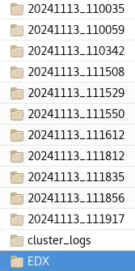
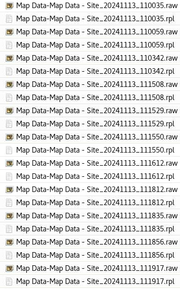

# SENDePSIC

Atomic structure analysis with 3D radial average or radial variance profile datasets. It was developed originally for the ePSIC data processing workflow (visit [ePSIC's data processing workflow](https://github.com/ePSIC-DLS/User-Notebooks/tree/master/ePSIC_Standard_Notebooks)). However, it can be generally used for any profile dataset.

## Installation

To install the package locally in editable mode:
```bash
pip install -e .
```

## How to use
Please see jupyter notebooks in SENDePSIC/execution_notebook

## Analysis for concurrent 4DSTEM-EDX datasets collected at ePSIC, Diamond Light Source
   
The EDX data must be stored as shown in the images above (~/subfolder/EDX/\*.rpl)

## Compatibility notes

### NumPy 2.x Support
While this package uses third-party libraries (such as `py4DSTEM` and `exspy`) that contain legacy references incompatible with NumPy 2.x, we provide out-of-the-box compatibility:
- **Dependency Pinning**: `numpy<2.0` is pinned in `requirements.txt` and `setup.py` to default to stable NumPy 1.x environments.
- **Automated Import Patches**: If imported in an environment already running NumPy 2.x, the package dynamically patches required namespaces on-the-fly (e.g., mapping missing dtype aliases and wrapping array type conversions in `py4DSTEM` and `exspy`) so that all analysis workflows execute without modifications.
